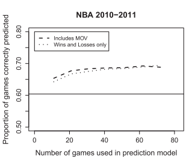

```{css style, echo=FALSE}
.tocify-item {
  text-indent: 0px;
}

.tocify {
  margin: 5px 10px;
  font-size: 1.7rem;
}

body {
  font-size: 14px;
}

.list-group-item.active, .list-group-item.active:hover, .list-group-item.active:focus {
  font-style: oblique;
  color: #154067;
  background-color: #ffffff;
}
```

```{r setup, include=FALSE, message=FALSE}
library(tidyverse)
library(lubridate)
library(BradleyTerry2)
library(Matrix)
library(printr)
library(furrr)

options(width = 80)
set.seed(07301999)

# Data is scraped using files from sports_scraper and then processed through days_since_last_game.R
nba <- read_csv(file = "data/nba.csv", col_types = cols(game_date = col_date(format = "%Y-%m-%d"), season = col_factor()))
# nfl <- read_csv(file = "data/nfl.csv", col_types = cols(game_date = col_date(format = "%m/%d/%y"), season = col_factor()))
# nhl <- read_csv(file = "data/nhl.csv", col_types = cols(game_date = col_date(format = "%m/%d/%y"), season = col_factor()))
```

<script type="text/x-mathjax-config">
MathJax.Hub.Config({
  TeX: { equationNumbers: { autoNumber: "AMS" } }
});
</script>

## Initial Bradley-Terry Model
I restrict our sample to a single season of NBA for now and just run a simple Bradley-Terry for evaluating the strength parameters $\theta_s$ for all teams $s$ as well as the home field advantage regressor $\alpha$. This model is representative of (1) where $\pi_{i,j}$ is the probability $i$ (home) beats $j$ (away). I use the BradleyTerry2 package, which simply estimates each parameter by maximum likelihood.

\begin{equation} 
  \ln\left( \frac{\pi_{i,j}}{1 - \pi_{i,j}} \right) = \theta_i - \theta_j + \alpha
\end{equation}

```{r bt}
# Filter down to one season and make sure factors for each team are consistent
nba_11 <- nba %>%
  filter(season == "2011") %>%
  mutate(
    home = as.factor(home),
    away = as.factor(away)
    )

# Fit Bradley-Terry rating model for binary outcomes
nba_11_btm <- BTm(outcome = home_win, #1 if player1 (home) wins and 0 if player2 (away) does
    player1 = data.frame(team = home, hfa = 1), 
    player2 = data.frame(team = away, hfa = 0),
    formula = ~team + hfa, id = "team", data = nba_11)

summary(nba_11_btm)
```

HFA seems to increase a teams strength parameter quite a lot (0.53427) with a high statistical significance from the null. That's about the difference between last place 30th Minnesota Timberwolves (-1.521) and the middle of the pack 14th Houston Rockets (0.069).

```{r bt_plot, echo=FALSE}
qvcalc(BTabilities(nba_11_btm))$qvframe %>% #quasi normal standard errors
  rownames_to_column(var = "team") %>%
  ggplot(aes(x = reorder(as.factor(team), estimate), color = as.factor(team))) +
  geom_point(aes(y = estimate)) +
  geom_errorbar(aes(ymin = estimate - quasiSE, ymax = estimate + quasiSE)) + 
  coord_flip() + theme(legend.position = "none") + xlab("Team") + ylab(expression(theta))
```

## Days Since Last Game

I add another variable within the Bradley-Terry model to measure the effect of how much down time teams have in between their matches. The variable **days_out** aims to measure the effect each day out a team is from their last game has on their odds of winning. This is shown in (2) with $\delta_{i}$ and $\delta_{j}$ representing the days since $i$ and $j$ played their last game respectively and $\beta$ being the effect parameter.

\begin{equation}
  \ln\left( \frac{\pi_{i,j}}{1 - \pi_{i,j}} \right) = \theta_i - \theta_j + \alpha + \delta(d_{i} - d_{j})
\end{equation}

```{r bt_days}
# Fit Bradley-Terry rating model for binary outcomes
nba_11_btm_days <- BTm(outcome = home_win, #1 if player1 (home) wins and 0 if player2 (away) does
    player1 = data.frame(team = home, hfa = 1, days_out = home_days_since_last_game), 
    player2 = data.frame(team = away, hfa = 0, days_out = away_days_since_last_game),
    formula = ~team + hfa + days_out, id = "team", data = nba_11)

summary(nba_11_btm_days)
```

My prior going into fitting this model is that coefficient for **days_out**, $\delta$ would likely be very insignificant. Just by my thinking, the amount of days in between matches might have a more complex relationship with winning odds and is likely not linear. For instance, a long time not playing may give teams an opportunity to rest but also can make them deconditioned from intense competition, on the flipside, a team can have a lot of momentum playing a lot frequently but can result in injuries and 'burnout'. 

We end up seeing a pretty small coefficient as well as a low absolute z score and higher p value. Most of the strength parameters are not really affected by the inclusion of this predictor, with the change across $\theta$'s being below the order of $0.01$. In addition to looking at a deeper number of lagged games, testing this across seasons as well as with the measuring information content through forecasting will be a good step forward.

```{r bt_days_plot, echo=FALSE}
qvcalc(BTabilities(nba_11_btm_days))$qvframe %>% #quasi normal standard errors
  rownames_to_column(var = "team") %>%
  ggplot(aes(x = reorder(as.factor(team), estimate), color = as.factor(team))) +
  geom_point(aes(y = estimate)) +
  geom_errorbar(aes(ymin = estimate - quasiSE, ymax = estimate + quasiSE)) + 
  coord_flip() + theme(legend.position = "none") + xlab("Team") + ylab(expression(theta))
```

I redo this model letting the coefficient for `home_days_since_last_game` and `away_days_since_last_game` be different and manually running the regression in glm.

```{r bt_manual}
nba_11_btm_model_matrix <- nba_11 %>%
  stack_games() %>%
  mutate(home_win = home_mov > 0) %>%
  spread(key = team, value = hfa, fill = 0) %>%
  select(-c(season, game_id, home_mov)) %>%
  cbind(nba_11$home_days_since_last_game, nba_11$away_days_since_last_game) %>%
  rename('home_days_since_last_game' = `nba_11$home_days_since_last_game`, 
         'away_days_since_last_game' = `nba_11$away_days_since_last_game`) %>%
  rbind(c(0, rep(1, length(levels(nba_11$home))))) # Linear Constraint, make the sum of all team parameters equal to 0

nba_11_btm_days_manual <- glm(formula = home_win ~ ., family = "binomial", data = nba_11_btm_model_matrix)
summary(nba_11_btm_days_manual)
```

It still remains that having more days out since last game for the home team reduces their chance of winning. On the flipside having more days out on the away team increase the home team's chance of winning. All in all, the model spits out a negative effect on winning probability for increased days out.

## Away Distance Traveled

Another feature I looked at was the distance that the away team had to travel before a particular match. This is similar to the previous theory that players may get burned out and possibly more burned out by having to travel more. The model is outlined below with $d_{j,i}$ being the distance between team $j$ and team $i$'s location. I use approximate locations based on cities rather than exact stadium locations.

\begin{equation}
  \ln\left( \frac{\pi_{i,j}}{1 - \pi_{i,j}} \right) = \theta_i - \theta_j + \alpha + \delta d_{j,i}
\end{equation}

```{r bt_distance}
# Fit Bradley-Terry rating model for binary outcomes
nba_11_btm_distance <- BTm(outcome = home_win, #1 if player1 (home) wins and 0 if player2 (away) does
    player1 = data.frame(team = home, hfa = 1, distance_traveled = 0), 
    player2 = data.frame(team = away, hfa = 0, distance_traveled = away_distance_traveled),
    formula = ~team + hfa + distance_traveled, id = "team", data = nba_11)

summary(nba_11_btm_distance)
```

```{r bt_distance_plot, echo=FALSE}
qvcalc(BTabilities(nba_11_btm_distance))$qvframe %>% #quasi normal standard errors
  rownames_to_column(var = "team") %>%
  ggplot(aes(x = reorder(as.factor(team), estimate), color = as.factor(team))) +
  geom_point(aes(y = estimate)) +
  geom_errorbar(aes(ymin = estimate - quasiSE, ymax = estimate + quasiSE)) + 
  coord_flip() + theme(legend.position = "none") + xlab("Team") + ylab(expression(theta))
```

## Quantifying Information Content: Random Sample Games

This process is marked by a few steps outlined by Wolfson-Koopmeiners. In general we want to:

* Fit a rating model on several training sets with proportion *p* of total season games
* Calculate predicted probabilities, $\pi_{ij}$ for the results of each match in the remaining season's games
* Simulate using the set of all $\pi$, the remaining season's games and measure the accuracy
* Repeat for different *p* across different seasons and leagues

I make functions for sampling a portion of the season games without replacement and applying the Bradley-Terry model. The models are then used to predict the remainder games up to a probability. These probabilities are then used to simulate results and we derive the information content metric (3) where $S, S'$ are the sets of actual results from the training and test set respectively and $R'$ is the set of simulated results using derived probabilities from the Bradley-Terry model trained on $S$. The equation is the proportion of correctly predicted results $r$ from games $S'$, to total games in $S'$.

\begin{equation*}
  \displaystyle I^{BT}(S, S', R') = \frac{| \{ \ r \in R' \ | \ r = s \in S' \}|}{| S' |}
\end{equation}

```{r info_content_helpers}
# For each proportion, make n_sets of training and test sets and bind into dataframe
training_split_df <- function(df, prop, n_sets) {
  train_list <- list()
  test_list <- list()

  for (p in prop) {
    for (idx in 1:n_sets) {
      #Create training set
      train <- df %>%
        sample_frac(p, replace = FALSE)

      #Create test set
      test  <- df %>%
        anti_join(y = train, by = 'game_id')

      train_list[[as.character(p)]][[idx]] <- train
      test_list[[as.character(p)]][[idx]] <- test
    }
  }

  tibble(
    train_prop = rep(prop, n_sets) %>% sort(),
    train = train_list %>% unlist(recursive = FALSE),
    test = test_list %>% unlist(recursive = FALSE)
  )
}

# Transform log_odds to prob
sigmoid <- function(log_odds) {
  1/(1 + exp(-log_odds))
}

#Function returns the sum of sim and actual predicting the same, conf.matrix = true only returns the confusion matrix version
pred_accuracy <- function(sim, actual, conf.matrix = FALSE) {
  if (conf.matrix) {
    return(xtabs(formula = ~ sim + actual))
  }

  return(sum(actual == sim)/length(actual))
}
```

For each training set, I fit the Bradley-Terry Model with HFA, I then use the model to predict the log odds for each match within the training set. This prediction is identical to plugging in the parameters to (1) Translating that to a probability using the sigmoid function, I then use a simple proportion of correct predictions of game outcomes from the Monte-Carlo simulation as an information metric.

I test below my method for finding information content on a 20 training and complementary test sets at one eigth of the season's games. There will be warnings for perfect separation in this case bcause of the small proportion of games. In an example I looked at, Boston was rated very highly because they won 4 away games in the set and that made predictions with them shoot to probability 1 in their favor.

Next steps will be to evaluate this method for sequential games as well as directly compare it to Wolfson Koopmeiner's information metric.

```{r info_content_exec}
#Sorry for the monster of a call, the gist is that I'm using a dataframe where some columns are also dataframes, using map makes things similar to apply functions to each dataframe element, futuremap is a parallel processing implementation of purrr's original map from the tidyverse

#Take a dataframe where each row is a training set and test set of a proportion
nba_11_info_sets <- training_split_df(df = nba_11, prop = c(0.125,0.25, 0.375, 0.50, 0.625, 0.75, 0.875), n_sets = 100)

nba_11_info_metrics <- nba_11_info_sets %>%
  group_by(train_prop) %>%
  mutate(
    set_id = row_number(),
    btm = future_map(.x = train, .f = ~BTm(outcome = home_win,
                                           player1 = data.frame(team = home, hfa = 1), player2 = data.frame(team = away, hfa = 0),
                                           formula = ~team + hfa, id = "team", data = .x)),
    pred_logit = future_map2(.x = test, .y = btm, .f = ~predict(object = .y, newdata = .x)),
    pred_prob = future_map(.x = pred_logit, .f = sigmoid),
    sim = future_map(.x = pred_prob, .f = ~ifelse(test = .x < 0.6 & .x > 0.4, yes = rbinom(n = length(.x), size = 1, p = .x), no = (. > 0.5))),
    # sim = future_map(.x = pred_prob, .f = ~rbern(n = length(.x), p = .x)),
    naive_sim = future_map(.x = pred_prob, .f = ~(. > 0.5)),
    actual = future_map(.x = test, .f = ~pull(.data = .x, var = 'home_win')),
    info_metric = unlist(future_map2(.x = sim, .y = actual, .f = ~pred_accuracy(sim = .x, actual = .y))),
    wolfson_info_metric = unlist(future_map2(.x = naive_sim, .y = actual, .f = ~pred_accuracy(sim = .x, actual = .y)))
  )
```

```{r info_metrics_eval}
nba_11_info_metrics %>%
  summarise(mean_info_metric = mean(info_metric),
            median_info_metric = median(info_metric),
            mean_wolfson_info_metric = mean(wolfson_info_metric),
            median_wolfson_info_metric = median(wolfson_info_metric)
            )
```



I was able to reproduce the NBA 2010-2011 season results from Wolfson Koopmeiner's paper for the mean information metric. In that paper they simply take the predicted probability of the match result and predict a win if the probability is over 0.5. The same information metric in (4) based off of predicted results is used.

However, we see a pretty significant difference when implementing an info metric based off of a Monte-Carlo simulation from the predicted probabilties rather than the simple greater than 0.5 rule used in the paper. Next steps are to fit a similar quadratic curve as is what's seen in the paper to see how it would compare to the visual crux of the paper.

## Margin of Victory
Now, we try a margin of victory to predict $\theta_i$ where the intercept parameter in the linear model represents a home field advantage. In (2), $\delta_{i,j}$ represents the number of points $i$ (home) has over $j$ (away) and is negative if $j$ won.

\begin{equation}
  \delta_{i,j} = \theta_i - \theta_j + \alpha
\end{equation}

\begin{equation}
  \mathbf{X \theta} = \mathbf{y}
\end{equation}
<br>
\[
\mathbf{X} =
\begin{bmatrix}
\begin{array}{rrrrrrr}
1 & 0 & -1 & 0 & 0 & \cdots  & 0\\
0 & 0 & 1 & 0 & -1 & \cdots  & 0\\
-1 & 0 & 1 & 0 & 1 & \cdots  & 0\\
\vdots &  &  & &  & \ddots  & \vdots\\
0 & -1 & 0 & 0 & 0 & \cdots  & 1 \\
1 & 1 & 1 & 1 & 1 & \cdots  & 1
\end{array}
\end{bmatrix}, \quad
\mathbf{r} =
\begin{bmatrix}
\begin{array}{r}
\theta_1 \\
\theta_2 \\
\theta_3 \\
\vdots\\
\theta_s
\end{array}
\end{bmatrix}, \quad
\mathbf{y} =
\begin{bmatrix}
\begin{array}{r}
y_1 \\
y_2 \\
y_3 \\
\vdots\\
y_k \\
0
\end{array}
\end{bmatrix}
\]
<br>

Thus, for a season with $k$ games and $s$ teams, (3) is our system of linear equations. The sparse matrix $\mathbf{X}_{k \times s}$ has each row representing a game, all elements in a particular row are 0 except for teams $i$ and $j$ participating in the game, with 1 under the winning team's column and -1 under the losing team's column. $\mathbf{\theta}_{s \times 1}$ is the vector of strength parameters and $\mathbf{y}_{k \times 1}$ is the point differential for each match. Because each row sums to 0, the columns of $\mathbf{M}_{s \times s}$ are not linearly independent and $rank(\mathbf{M}_{s \times s}) < s$ meaning that there is no unique solution to (2).

This is solved by including a linear constraint to $\mathbf{X}$ through a row constraint. A simple constraint is to have all of the strength parameters sum up to 1 $\left(\sum_S \theta_i = 0\right)$. This is done by inserting a row with all ones in $\mathbf{X}$ and having the corresponding element in the response vector, $\mathbf{y}$, be $0$.

```{r massey}
# Function records each instance of a team participating in a match, whether they were home or away
stack_games <- function(df, ...){
  home_teams <- df %>%
    select(season, game_id, home, home_mov, ...) %>%
    mutate(hfa = 1) %>%
    rename('team' = home)
  away_teams <- df %>%
    select(season, game_id, away, home_mov, ...) %>%
    mutate(hfa = -1) %>%
    rename('team' = away)
  return(bind_rows(home_teams, away_teams))
}

# Creates a column for each team and, in each game_id row, puts a 1 if they're the home team and a -1 if they're away, 0 otherwise
# Equivalent to a column of home_mov results and a design matrix for each game
# home_mov = home - away + hfa

mov_model_matrix <- nba_11 %>%
  stack_games %>%
  spread(key = team, value = hfa, fill = 0) %>%
  select(-c(season, game_id)) %>%
  rbind(c(0, rep(1, length(levels(nba_11$home))))) # Linear Constraint, make the sum of all team parameters equal to 0

mov <- lm(formula = home_mov ~., data = mov_model_matrix)
summary(mov)
```

Strength parameters represent a shift of the expected margin of victory over the other team. An example being a match up between Atlanta Hawks (-1.2021) and Phoenix Suns (-0.5638), with the Atlanta Hawks having the home-field advantage, would have an expected margin of victory of $\theta_{AH} - \theta_{PS} + \alpha = 2.5292$ in favor of the Atlanta Hawks.

```{r massey_plot}
mov_thetas <- coef(summary(mov)) %>%
  data.frame() %>%
  rownames_to_column(var = "team") %>%
  filter(team != "(Intercept)")

mov_thetas %>%
  ggplot(aes(x = reorder(as.factor(team), Estimate), color = as.factor(team))) +
  geom_point(aes(y = Estimate)) +
  geom_errorbar(aes(ymin = Estimate - Std..Error, ymax =Estimate + Std..Error)) +
  coord_flip() + theme(legend.position = "none") + xlab("Team") + ylab(expression(theta))
```

In reference to the results in the Bradley-Terry model, home-field advantage tends to add about a 3 point margin of victory. A few teams changed in the ranking, because some teams lost in blow outs. A drastic change was in the last place team, Minnesota, who had lost some closer games, going from the lowest strength parameter according to Bradley-Terry to 5th from lowest according to Massey.
